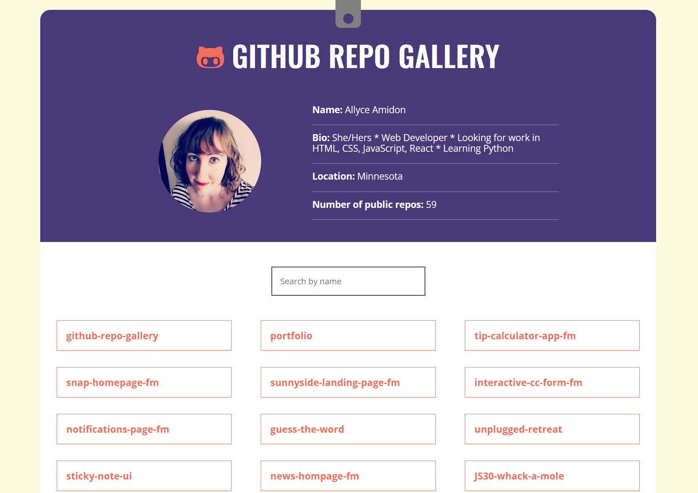

# Skillcrush - GitHub Repo Gallery Project

This is the code for the [Skillcrush GitHub Repo Gallery Project](https://skillcrush.com/). 

## Table of contents

- [Overview](#overview)
  - [The challenge](#the-challenge)
  - [Screenshot](#screenshot)
  - [Links](#links)
- [My process](#my-process)
  - [Built with](#built-with)
- [Author](#author)

## Overview

### The challenge

Users should be able to:

- Interact with the projects
- Search the projects by typing in the search box
- Click through to view the repos on GitHub

### Screenshot

### Links

- Code URL: [https://github.com/amidona/github-repo-gallery](https://github.com/amidona/github-repo-gallery)
- Live Site URL: [https://amidona.github.io/github-repo-gallery/](https://amidona.github.io/github-repo-gallery/)

## My process

### Built with

- [React](https://reactjs.org/) - JS library
- APIs

## Author

- Website - [Allyce Amidon](https://allyceamidon.com/)
- GitHub - [@amidona](https://github.com/amidona)

